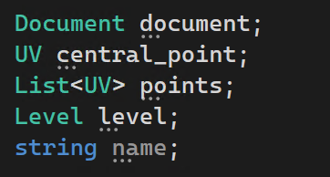

# Introduction

The repository contains the guidance and initial code for the project 1 in CIVL6059

# Preliminaries

### 1. Autodesk Revit

- The carrier of this project, where all the works are shown

#### 1.1 Installation

- Download from https://www.autodesk.com/
  - Sign up and login with your student email and apply for the student certification
  - Download Revit with Free Trial in the Education Community
  - Recommend to use the 2022 version

#### 1.2 Configuration for Revit secondary development with RevitAPI

- There are many tutorials online for configuration for Revit secondary development

- Key elements

  - RevitLookup: view and navigate BIM element parameters, properties and relationships, which can assist your development (Recommend the RevitLookup-2022.3.8-SingleUser.msi version)
  - Add-In Manager: where you can open and debug the plug-in you have written

- This step is done with these two buttons (Exteral Tools and RevitLookup) appear

  

### 2. Microsoft Visual Studio

- The integrated development environment (IDE) where you can code and test.

#### 2.1 Installation

- Download from https://visualstudio.microsoft.com/zh-hans/downloads/

  - Using the Community version which can be free downloaded

  - Recommend the 2022 version

  - Required workloads

    - After download, there are a list of workloads from which the following two options are required

      

#### 2.2 Import of RevitAPI.dll and RevitAPIUI.dll

- These two dll references allow you to access RevitAPI in the development environment

- Without these two dll references, there will be errors in using RevitAPI

  

- To add the references, you need to

  - Add references

    

  - Choose the RevitAPI.dll and RevitAPIUI.dll in your Revit folder

    

  - Add them to your refenrences

    

  - This step is done when there is no longer error when you import RevitAPI

    

### 3. Copilot (Optional)

- Copilot is an AI tool which can assist your development in the IDE
- You can apply the free trial of Copilot with student certification in https://github.com/features/copilot

- After obtaining the free trial approved by GitHub, you can integrate Copilot in your VS studio

  - Firstly, add the extension of Copilot through Manage Extensions

    

  - Secondly, add the extension after searching for Copilot

    

  - You can also add other extensions to improve your efficiency

# Revit Secondary Development

### 1. Introduction

- Revit secondary develoment customize and extend Autodesk Revit's capabilities using its API (Application Programming Interface). This process allows developers to automate tasks, create custom tools, or integrate Revit with other software systems to enhance functionality for specific workflows. Typically, Revit secondary development is done using C# and .NET framework, with Revit's API providing access to elements like building components, geometry, and project data
- A tutorial to C#: https://www.runoob.com/csharp/csharp-variables.html
  - However, with the help of intial code and Copilot, you don't need to master C# completely
- RevitAPI document: in this ducument, you can search and view all the classes and functions provided by RevitAPI
- A good tutorial to help you learn Revit secondary development: https://www.bilibili.com/video/BV1jt411E7As/?spm_id_from=333.999.0.0
  - That's how I learn Revit secondary development

### 2. "Hello World" in Revit secondary development

- Writing a "Hello World" program is a typical process when accesing a new programming framework, which can help you understand the basic programming environment

#### 2.1 Create a new project

- Click the Create a new project button

  

- Choose the Class Library (.NET Framework)

  

- Configure the project

  

#### 2.2 The "Hello World" program

- Code for the program


- Execute the program in the VS studio

  

- Invoke your plug-in in the Revit environment

  - Click the External Tools and choose Add-In Manager (Manual Mode)

    

  - Click Load button and pick the corresponding dll file  of your program

    

  - Select the dll file with the same name as your project

  

  - Run the selected dll file

    

  - Either is ok

    

  - The program can now say "Hello World"

    

# Revit Secondary Development for MiC floorplan Generation and Configuration

- Floorplan indicates the spatial arrangement of internal building layouts.

### 1. MiC Floorplan

- For the representation of MiC floorplan, we follow the ModularGraph proposed in https://www.sciencedirect.com/science/article/pii/S0926580523004004. This paper characterized MiC floorplan in a graph, with spaces as nodes and relationships among spaces as edges

#### 1.1 Elements in the modular building layouts

- **Functional space**, denoting the spatial configuration within the layout of a modular building with specific functionalities. This constitutes the principal element of the layout. Functional spaces identified in this research encompass the living room, kitchen, bedroom, bathroom, internal hall, and external hall (abbreviated as LR, KC, BR, BA, IH, and EH, respectively), while maintenance rooms, such as plumbing and drainage rooms, are considered part of their adjacent spaces

- **Adjacency relationship**, denoting the proximity between spaces caused by sharing boundaries. Adjacency relationships intuitively convey the arrangement of spaces and have a decisive impact on the final geometric layout of the floor plan
- **Adjacency intensity**, signifying the extent of proximity between spaces. Various types of adjacency relationships between rooms can be observed in layouts, such as enclosure, interlocking, and boundary adjacency, contributing to greater design flexibility
- **Connectivity relationship**, referring to accessibility between spaces, attained through doors or open wall structures. Accessibility is a pivotal element in layout design, influencing not only traffic flow but also extending its impact to essential aspects of house usage, such as air circulation and lighting conditions
- **Connectivity intensity**, signifying the extent of accessibility between spaces. An example underscoring the necessity of identifying the connectivity intensity is the utilization of enclosed and open spaces in layouts, a design language that ought not to be overlooked
- **Conjoint relationship**, referring to the association between two spaces due to their coexistence in one module. The modular building layouts design must be carried out within the constraints of modular spaces, and as a result, the conjoint relationship in modular building layouts is a recognizable and critical feature to convey

#### 1.2 Element in the graph

The objective of this paper is to utilize basic graph elements to represent identified information embedded in modular building layouts. Like any graph structure, it comprises nodes, edges, and weights, with their definitions as follows:

- **Nodes** represent spaces, storing the functional description of the space in the form of string values as node attributes. Each node has one singular function. For instance, a node cannot simultaneously represent a living room and a bedroom

- **Edges** represent the spatial relationships between spaces, including adjacency, connectivity, and conjoint relationships. As the resulting graph is a multigraph, which means that multiple edges, representing the multiple spatial relationships, could coexist between identical nodes simultaneously, forming a graph triumvirate

- **Weights** represent the intensity of spatial relationships in numeric values. A higher weight signifies a more robust relationship, whereas a lower value implies a weaker one

### 2. MiC Floorplan in Revit Secondary Development (Current Basic Implementation)

- For your convenience, I have provided some basic implementation, which can boost your understanding in Revit secondary development and assist your development process.

#### 2.1 Some used internal classes in RevitAPI

- `Level`: the specific floor level of the building
- `UV`: the coordinates of points on a 2-dimensional grid, with U indicating the x-axis and V indicating the y-axis
- `XYZ`: the the coordinates of points on a 3-dimensional grid, with U indicating the x-axis, V indicating the y-axis, and Z indicating the z-axis
- `Wall`: the class of the walls within the building
- `Floor`: the class of flooring used within the building
- `FamilyInstance`: the class of doors and windows used within the building

#### 2.2 The Module class

- A module is a basic element in the MiC floorplan, where various rooms exist

- The code in `CodeAgent/Module.cs` provides a initial implementation for MiC module, which includes

  - Attributes for the module, which can represent a module uniquely. The `document` is the context where your model exists, the list of `points` are the four boundary points of the module, the `level` represents the base level of the floor of the module, and the `name` indicates the name of the module

    

  - Two constructor functions for constructing a new module

    - `public Module(Document document, UV point_1, UV point_2, UV point_3, UV point_4, Level level, string name)`, which constructs a Module class given four boundary points
    - `public Module(Document document, Module module_1, Module module_2)`, which merges two existing Module classes into one new Module class 

  - Several functions in the Module class

    - `public UV GetSoutheastPoint()`, which gets the southeast point of the module
    - `public UV GetSouthwestPoint()`, which gets the southwest point of the module
    - `public UV GetNorthwestPoint()`, which gets the northwest point of the module
    - `public UV GetNortheastPoint()`, which gets the northeast point of the module
    - `public Wall GetEastWall()`, which gets the east wall of the module
    - `public Wall GetSouthWall()`, which gets the south wall of the module
    - `public Wall GetWestWall()`, which gets the west wall of the module
    - `public Wall GetNorthWall()`, which gets the north wall of the module
    - `public Module CreateModuleToSouth(double north_south_length, double east_west_length, string alignment)`, which create a new module to the south of the current module , where `north_south_length` is the length of the module from the north-south direction, `east_west_length` is the length of the module from the east-west direction, `alignment` has two options 'west' and 'east', indicating whether the new module is aligned west or east of the current module
    - `public Module CreateModuleToNorth(double north_south_length, double east_west_length, string alignment)`, which creates a new module to the north of the current module, where `north_south_length` is the length of the module from the north-south direction, `east_west_length` is the length of the module from the east-west direction, `alignment` has two options 'west' and 'east', indicating whether the new module is aligned west or east of the current module
    - `public Module CreateModuleToEast(double north_south_length, double east_west_length, string alignment)`, which creates a new module to the east of the current module, where `north_south_length` is the length of the module from the north-south direction, `east_west_length` is the length of the module from the east-west direction, `alignment` has two options 'north' and 'south', indicating whether the new module is aligned north or south of the current module
    - `public Module CreateModuleToWest(double north_south_length, double east_west_length, string alignment)`, which creates a new module to the west of the current module, `north_south_length` is the length of the module from the north-south direction, `east_west_length` is the length of the module from the east-west direction, `alignment` has two options 'north' and 'south', indicating whether the new module is aligned north or south of the current module

#### 2.3 The Room class

- A room is a clear definition of an area of space. In Revit, it is set by using the room tag which creates a room bounded by model elements (e.g., walls, floors, and ceilings) and separation lines. As I haven't found an approach to create separation lines in Revit using RevitAPI, all the rooms are separated by walls now

- The code in `CodeAgent/Room.cs` provides a initial implementation for a room, which includes

  - Attributes for a room, which can represent a room uniquely. the `document` is the context where your model exists, `central_point` represents the central point of a room, the list of `points` are the four boundary points of the room, the `level` represents the base level of the floor of the room, and the `name` indicates the name of the room

    

  - Five constructor functions for constructing a new room
    - `public Room(Document document, Module module, Level level, string name)`, which constructs a Room class in a given module (this room takes up all the space of the module)
    - `public Room(Document document, Module module, UV point_1, UV point_2, UV point_3, UV point_4, Level level, string name)`, which constructs a Room class in the module given four boundary points
    - `public Room(Document document, Module module, UV central_point, double north_south_length, double east_west_length, Level level, string name)`, which constructs a Room class given the located module, the central point, the north-south length, and the east-west length of the room
    - `public Room(Document document, Module module, string direction, double length, Level level, string name)`, which constructs a Room class given the located module, the direction of the room in the module, and the length of the room (This room occupies the space of the module in the direction of length)
    - `public Room(Document document, Module module, string corner, double north_south_length, double east_west_length, Level level, string name)`, which constructs a Room class given the located module, the corner orientation of the room in the module, and the length of the room from the north-south and east-west direction

  - Several functions in the Room class
    - `public UV GetSoutheastPoint()`, which gets the southeast point of the room
    - `public UV GetSouthwestPoint()`, which gets the southwest point of the room
    - `public UV GetNorthwestPoint()`, which gets the northwest point of the room
    - `public UV GetNortheastPoint()`, which gets the northeast point of the room
    - `public Wall GetEastWall()`, which gets the east wall of the room
    - `public Wall GetSouthWall()`, which gets the south wall of the room
    - `public Wall GetWestWall()`, which gets the west wall of the room
    - `public Wall GetNorthWall()`, which gets the north wall of the room

#### 2.4 The Utils class

- The `CodeAgent/Utils.cs` provides some useful functions for development

  - `public static bool IsEqual(XYZ point_1, XYZ point_2)`, which determines whether two 3-dimensional points are equal
  - `public static UV MidPointForLine(UV point_1, UV point_2)`, which calculates the midpoint of a line consisting of two 2-dimensional points
  - `public static UV MidPointForRectangle(UV point_1, UV point_2, UV point_3, UV point_4)`, which calculates the midpoint of a rectangle consisting of four 2-dimensional points
  - `public static UV MidPointForWall(Wall wall)`, which calculates the midpoint of a wall

  - `public static Wall CreateWall(Document document, UV point_1, UV point_2, Level level, string name)`, which creates a wall with two 2-dimensional boundary points of the wall. *Note: the "Wall-Ret_300Con" should be set to your own wall type in your Revit*
  - `public static void DeleteWall(Document document, UV startPoint, UV endPoint)`, which deletes a wall given its 2-dimensional start point and end point
  - ` public static Floor CreateFloor(Document document, UV point_1, UV point_2, UV point_3, UV point_4, Level level, string name)`, which creates a floor with four 2-dimensional boundary points. *Note: the "Floor_Timber_22Cbd-225Joist" should be set to your own floor type in your Revit*

  - `public static FamilyInstance CreateDoor(Document document, UV point, Wall wall, Level level)`, which creates a door with one 2-dimensional point and the wall that the door is on. *Note: the "Doors_IntSgl" should be set to your own door type in your Revit*

  - `public static FamilyInstance CreateWindow(Document document, UV point, Wall wall, Level level)`, which creates a window with one 2-dimensional point and the wall that the window is on. *Note: the "Windows_Sgl_Plain" should be set to your own door type in your Revit*

  - `public static Module MergeModule(Document document, Module module_1, Module module_2, Level level)`, which merges the areas in two modules into one area in one module
  - `public static void CreateMergedWalls(Document document, UV point_1, UV point_2, UV point_3, UV point_4, Level level)`, which creates new wall for the merged area

  - `public static Wall FindSharedWall(Document document, Room room_1, Room room_2, Level level)`, which finds the shortest shared wall between two rooms
  - `public static Wall WallofOverlappedRooms(Document document, UV point_1, UV point_2, UV point_3, UV point_4, UV point_5, UV point_6, UV point_7, UV point_8)`, which determines whether the areas of two rooms overlap, and if so, return the overlapping wall
  - `public static Wall FindShortestSharedWall(Document document, UV point_1, UV point_2, UV point_3, UV point_4, Level level)`, which finds the shortest shared wall between two modules given four points
  - `public static Wall GetWallByTwoPoints(Document document, UV point_1, UV point_2)`, which gets the wall based on two points
  - `public static FamilyInstance CreateDoorBetweenRooms(Document document, Room room_1, Room room_2, Level level)`, which creates a door between two rooms
  - `public static FamilyInstance CreateDoorOrWindowBetweenRoomAndExternalSpace(Document document, Room room, Level level, string type)`, which creates a door or window between a room and the external space

#### 2.5 Additional code

- To faciliate your further development and assist in your studying, I also included some functions on the creation, deletion, modification, and retrieval of architectural elements' instance and type properties
- `PropertyFunctions` contains the code for these property manipulation functions on nine building elements: ceiling, architecural column, door, floor, ramp, roof, stair, wall, and window
- Note that these functions don't at the same namespace with the `CodeAgent` folder, you should carefully check and modify before using them
- When modifying the material and color of a building element, e.g., wall, floor and ceiling. I wrote the code with a simple hypothesis that all the elements only have one layer. However, in practical scenarios, each element may have multiple layers with different parameters. You can modify my current code to implement this relatively complex function

#### 2.6 Demonstration

- Here I gave a simple example of using existing codes for MiC floorplan generation. This example consists of two modules, with a bedroom located in the module_1 and a living room locate in the module_2

- Code in `CodeAgent/MainClass.cs` for this example:

  

- After execute this example in the VS studio and Revit, the corresponding MiC floorplan was generated as follow (Floor plans view and 3D view)

  - Floor plans view

    

  - 3D view

    

# Integration of Large Language Models (LLMs)

### 1. Common commercial LLMs

- ChatGPT: https://chatgpt.com/
- Claude: https://claude.ai/new
- Gemini: https://gemini.google.com/app
- Yiyan: https://yiyan.baidu.com/
- And other LLMs (e.g., Llama and Mistral) can be accessed on https://poe.com/

### 2. Facilitate MiC Floorplan Generation 

LLMs can serve as intermediary agent between users and BIM authoring software (Revit in this project), where corresponding code is generated given user natural language-based requirements. The code can then be executed with Revit secondary development and produce desired BIM models

### 3. An Example of Configuration Using LLMs

#### 3.1 Intial code and representation of a module

- Code of the module


- Executed result in Revit

  

- Now a user gives a new requirement to additional generation and configuration

  "Create a new module to the north of module_1. The module, named module_2, has the same dimension with module_1. After creating module_2, merge it with module_1. Next, split the resulting new module into two rooms, a bedroom and a living room, along the north-south direction. The size ratio should be 1:2, with the bedroom to the west of the living room. Finally, create a door between the bedroom and the living room."

#### 3.2 Prompt engineering to guide LLMs to make configurations in respond to the user's requirement

- A specific prompt was designed to encapsulate all required information, the prompt include the following key points

  - Task description (provide appropriate guidance for LLMs)

    - ```
      As an experienced architect skilled in floorplan design and a professional developer proficient in Revit secondary development using C#, your task is to reorganize and configure a flat's floorplan using RevitAPI in the context of modular construction. You will begin with a preliminary flat's floorplan and its corresponding C# code. Your goal is to reorganize and reconfigure this floorplan to meet specified requirements and regulations and update the "Execute" function in C# accordingly.
      
      The flat's floorplan is situated within a two-dimensional coordinate grid, consisting of two modules represented by floors and surrounded walls. Since there lacks a method to represent modules in the Revit environment, each module is represented as a floor in this task. The extent of a floor is the extent of the corresponding module. Points on the floorplan are denoted as (x, y), and there are currently eight points. All numerical values are in feet.
      ```

  - Initial code of current floorplan (provide code basis of the initial floorplan for LLMs)

    - ```
      The "Execute" function is the primary code body that creates floors for modules enclosed by walls and defines the rooms. The function is as follows:
      """
      public Result Execute(ExternalCommandData commandData, ref string message, ElementSet elements)
      {
          UIDocument uidoc = commandData.Application.ActiveUIDocument;
          Document doc = uidoc.Document;
          Level level = new FilteredElementCollector(doc)
              .OfClass(typeof(Level))
              .WhereElementIsNotElementType()
              .Cast\<Level\>()
              .FirstOrDefault(x => x.Name == "Level 0");
          // 2-dimensional boundary points of module_1
          UV point_1 = new UV(0, 0);
          UV point_2 = new UV(20, 0);
          UV point_3 = new UV(20, 10);
          UV point_4 = new UV(0, 10);
          // create modules
          Module module_1 = new Module(doc, point_1, point_2, point_3, point_4, level, "module_1");
          // create rooms in the modules
          Room bedroom = new Room(doc, new_module, point_1, dividingPoint1, dividingPoint2, point_8, level, "Bedroom");
          return Result.Succeeded;
      }
      """
      ```

  - Class basis for the LLMs

    - Here you should provide and describe classes that are used now and that LLMs may use in their generation

    - For example:

      ```
      You are dealing with the following classes:
      """
      Level: the specific floor level of the flat.
      UV: the coordinates of points on a 2-dimensional grid, with U indicating the x-axis and V indicating the y-axis.
      Wall: the class of the walls within the flat.
      Floor: the class of flooring used within the flat.
      FamilyInstance: the class of doors and windows used within the flat.
      """
      ```

  - Function basis for the LLMs

    - Here you should provide and describe functions that are used now and that LLMs may use in their generation
    - You can paste the function introductions as in the previous section (in the `CodeAgent/Module.cs`, `CodeAgent/Room.cs`, and `CodeAgent/Utils.cs`)

  - Regulations to retrict the behaviours of LLMs

    - You can design specific regulations to improve the performance of LLMs

    - For example:

      ```
      There are specific regulations to adhere to in this task:
      """
      (1) In the two-coordinate grid, the y-axis represents the north-south direction, while the x-axis represents the east-west direction. The positive y-axis indicates movement towards the north, and the positive x-axis indicates movement towards the east.
      (2) Each room must be surrounded by walls to separate it from other rooms and external spaces.
      (3) The point at which a room is created must be situated within that room.
      (4) Each room must be located in one or multiple modules (floors).
      (6) Only update and return the complete code of "Execute" function and refrain from creating new functions.
      (7) Don't omit anything in the "Execute" function.
      """
      ```

  - As some tasks including multiple steps may be hard for LLMs, you can also provide some hints for them

    - For example:

      ```
      Hints for the reorganization and configuration:
      """
      (1) Divide the task into multiple subtasks and execute them sequentially.
      (2) Always create walls before creating rooms.
      (3) When creating a new room within a module, calculate the precise location and size of the new room, and separate it from the existing room with walls.
      (4) When dividing the current module, calculate the location and size carefully based on the direction.
      (5) Before installing a door, calculate and determine the appropriate placement. Unless otherwise specified, the door is located in the midpoint of the wall.
      (6) Doors must be constructed on walls and not at wall junctions.
      (7) When creating a door between two rooms, ensure to accurately calculate the shared wall between the two rooms and install the door accordingly on that wall.
      """
      ```

  - With all the above information, you can finally add the requirement from the user in the prompt

    - ```
      Requirements for the reorganization and configuration:
      """
      Create a new module to the north of module_1. The module, named module_2, has the same dimension with module_1. After creating module_2, merge it with module_1. Next, split the resulting new module into two rooms, a bedroom and a living room, along the north-south direction. The size ratio should be 1:2, with the bedroom to the west of the living room. Finally, create a door between the bedroom and the living room.
      """
      ```


#### 3.3 Reorganization and configuration with LLMs

- The code returned by LLMs

  ```
  public Result Execute(ExternalCommandData commandData, ref string message, ElementSet elements)
  {
      UIDocument uidoc = commandData.Application.ActiveUIDocument;
      Document doc = uidoc.Document;
      Level level = new FilteredElementCollector(doc)
          .OfClass(typeof(Level))
          .WhereElementIsNotElementType()
          .Cast<Level>()
          .FirstOrDefault(x => x.Name == "Level 0");
      // 2-dimensional boundary points of module_1
      UV point_1 = new UV(0, 0);
      UV point_2 = new UV(20, 0);
      UV point_3 = new UV(20, 10);
      UV point_4 = new UV(0, 10);
      // 2-dimensional boundary points of module_2
      UV point_5 = new UV(0, 10);
      UV point_6 = new UV(20, 10);
      UV point_7 = new UV(20, 20);
      UV point_8 = new UV(0, 20);
      // create modules
      Module module_1 = new Module(doc, point_1, point_2, point_3, point_4, level, "module_1");
      Module module_2 = new Module(doc, point_5, point_6, point_7, point_8, level, "module_2");
      // merge module_1 and module_2
      Module new_module = Utils.MergeModule(doc, module_1, module_2, level);
      // calculate dividing line for Bedroom and Living Room
      UV dividingPoint1 = new UV(6.67, 0);
      UV dividingPoint2 = new UV(6.67, 20);
      // create dividing wall
      Wall dividingWall = Utils.CreateWall(doc, dividingPoint1, dividingPoint2, level, "DividingWall");
      // create Bedroom and Living Room
      UV bedroomCenter = Utils.MidPointForRectangle(point_1, dividingPoint1, dividingPoint2, point_8);
      UV livingRoomCenter = Utils.MidPointForRectangle(dividingPoint1, point_2, point_7, dividingPoint2);
      Room bedroom = new Room(doc, new_module, point_1, dividingPoint1, dividingPoint2, point_8, level, "Bedroom");
      Room living_room = new Room(doc, new_module, dividingPoint1, point_2, point_7, dividingPoint2, level, "Living room");
      // install door between Bedroom and Living Room
      Wall sharedWall = Utils.FindSharedWall(doc, bedroom, living_room, level);
      UV doorPoint = Utils.MidPointForWall(sharedWall);
      FamilyInstance Door = Utils.CreateDoor(doc, doorPoint, sharedWall, level);
      return Result.Succeeded;
  }
  ```

- Executed result in Revit

  

- Correct generation and configuration was made

# Tasks to be Completed

### 1. Issues in Current Implementation

- How to define the modules and relationships formally in our experimental environment based on the descriptions provided in the paper (https://www.sciencedirect.com/science/article/pii/S0926580523004004)
- In the first example, both rooms should have an area of 20 square meters. However, since I did not consider the volume of the walls, their areas were reduced to 16 square meters. How to define this precisely remains a problem
- The current representation of the intial module in the example appears somewhat simple. How can we refine it by integrating the existing MiC floorplan (https://www.bd.gov.hk/en/resources/codes-and-references/modular-integrated-construction/mic_acceptedList.html)
- Are their any prompt engineering approaches to improve the performance of LLMs (e.g., Chain-of-Thought prompting, which divides a complicated task into several simpler task and address a problem step by step)

### 2. What you can do

- Define modules, rooms, and their relationships formally in our experimental environment based on the paper (https://www.sciencedirect.com/science/article/pii/S0926580523004004)
- Fix the bug that ignores the wall volume
- Establish the initial MiC floorplan using code based on one or several floorplans on the website (https://www.bd.gov.hk/en/resources/codes-and-references/modular-integrated-construction/mic_acceptedList.html), which means that users can make desired configurations with natural language on current well-designed MiC floorplans
- Optimize the prompt to improve the performance of LLMs
- Add some other family instances in specific rooms (e.g., kits in kitchen and toilet) 
- Make some comparisons on different LLMs focusing on various aspects
  - For example
    - Can LLMs handle changes in module size (e.g, Increase the length of module_1 in the north-south direction by twofold)
    - Can LLMs handle changes in the module location (e.g., Move module_1 60 feet to the west)
    - Can LLMs handle changes in elements (e.g., Create a window on the south wall of module_1)
    - Can LLMs handle operations related to rooms (e.g., Create a bathroom in module_1's south-east corner. Additionally, install a door connecting the bedroom and the bathroom. The bathroom should have a north-south length of 4 feet and an east-west length of 7 feet)
    - Can LLMs handle operations related to modules (e.g., To the south of module_1, a new module called module_2 needs to be created, which should have a north-south length of 20 feet and an east-west length of 20 feet. Within module_2, split it from the east-west direction into two rooms, namely a kitchen and a living room, with a size ratio of 1:2. The kitchen should be positioned to the south of the living room. Additionally, doors need to be created between the living room and the bedroom, as well as between the living room and the kitchen.)
    - ......

- Besides the issues mentioned above, you can also have some interesting tries, for example, modify the material or color of an element (e.g., wall, floor, and ceiling)
